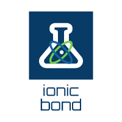

# ionic-bond

<div align="center">
  
</div>

<!--  -->

English | [简体中文](./README.zh-CN.md)

---

[](https://github.com/DarrenDanielDay/ionic-bond/actions/) [](https://github.com/DarrenDanielDay/ionic-bond/actions/) [](https://badge.fury.io/js/ionic-bond)

A library for updating immutable states in JavaScript applications.

## Introduction

This library is a very lightweight replacement for `immer`, the core implementation also uses the magic of `Proxy`, but the exported API only has a `solvent` function.

In other words, if you are worried about cumbersome code like below, you can try `ionic-bond` without having to include a huge `immer`.

```js
setState((prev) => ({
  ...prev,
  userStore: {
    ...prev.userStore,
    currentUser: {
      ...prev.userStore.currentUser,
      userName: "some updated user name",
    },
  },
}));
```

With `ionic-bond`, your code will look like this:

```js
import { solvent } from "ionic-bond";

setState(
  (prev) =>
    solvent() // If you are using `TypeScript`, you can use `solvent<YourType>()` to get type inference for the `obj` parameter.
      .ionize((obj) => obj.userStore.currentUser.userName)
      .dissolve(prev)
      .crystallize("some updated user name") // will return a new object with replaced `userName`
);
```

The reason for these API names is updating object in this form is much like dissolving some crystals in a solvent, then replacing some of the ions in the solution and recrystallizing.

Although these APIs can be designed as a function that accepts three parameters, in order to facilitate the reuse of property selectors and objects before updating, they are hierarchical, that is, curried at the API level.

## License

```text
 __________________
< The MIT license! >
 ------------------
        \   ^__^
         \  (oo)\_______
            (__)\       )\/\
                ||----w |
                ||     ||
```
